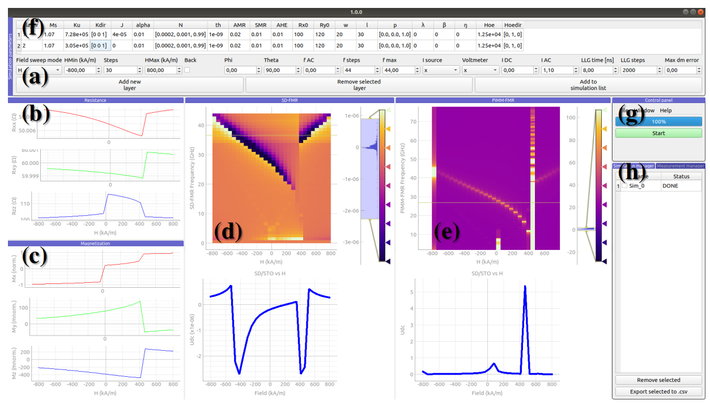

# Example

## Introduction
*PyMag* is a supplementary GUI programme that incorporates certain experimental procedures using the `cmtj` interface, such as M(H), R(H), PIMM or SD-FMR in a user-friendly interface. 
In this section, we discuss step by step how to reproduce a simple simulation with *PyMag* software. *PyMag* allows for the definition of the material parameters and stimuli of the spintronics device, the simulation process, the management of the simulation list, previewing and analysis of the simulation results, the management of loaded experimental data, the export of selected results, and the saving and loading of the entire simulation state. *PyMag* interface was based on open source libraries: *PyQt5* and *pyqtgraph* *Python*. In addition, *PyMag* allows the user to compare their experimental data with the simulated results using the **Experiment management** tab.

## Simulation overview
The structure parameters of each layer of the device must be defined in the table; see Fig.(f). Each row corresponds to a single ferromagnetic layer and contains a variety of parameters. For convenience we put them here, placing the units expected by *PyMag* in brackets: 

- magnetisation saturation $\mu_0 M_\mathrm{s} (\mathrm{T})$, 
- uniaxial anisotropy $K_\mathrm{u} (\mathrm{J/{m^3}}$), 
- interlayer exchange coupling, first order $J (\mathrm{J/{m^2}})$ and second order $J_2 (\mathrm{J/{m^2}})$, 
- geometrical properties (thickness, width , length  $d (\mathrm{m})$, $w (\mathrm{\mu m})$, $l (\mathrm{\mu m})$, respectively), 
- anisotropic magnetoresistance ($\mathrm{AMR}$), s
- pin Hall magnetoresistance ($\mathrm{SMR}$), 
- anomalous Hall effect ($\mathrm{AHE}$) (all in $\Omega$), 
- and the following dynamic parameters: damping factor $\alpha$, field-like torque $H_\mathrm{FL}$ ($\mathrm{A/m}$), damping-like torque $H_\mathrm{DL}$ ($\mathrm{A/m}$). 
  
The Oersted field excitation $H_\textrm{Oe}$ is given in the table in $\mathrm{1/m}$, as it is multiplied by the current value entered in the stimulus section. The following parameters are entered as vector quantities (each being a vector of dimension 3): 

- $\mathbf{K}_\mathrm{u dir}$, the direction of uniaxial anisotropy, 
- $\mathbf{N}_\textrm{demag}$, the diagonal of the demagnetisation tensor, 
- $\mathbf{p}$, the polarisation vector in the SOT torque, 
- and $\mathbf{H}_\textrm{Oedir}$, the direction of the Oersted field.

## Walkthrough
For a basic, demonstrative example we have chosen a trilayer structure, with two ferromagnetic layers separated with a spacer layer, Co/Ru/Co, which exhibits a quadratic interlayer exchange coupling, producing optical and acoustic lines in the FMR spectrum. 
The multilayer parameters used in the simulations are grouped in Tab.\ref{tab:parameters-pymag}.

Then we move on to the definition of a stimulus, which can be defined in the **Stimulus** tab.
In *PyMag* we follow a physical spherical coordinate system that designates $\theta$ as the polar angle (measured from the positive z-axis), and $\phi$ as the azimuth angle. In our software, the external field excitation may be swept either by magnitude or by any of those two angles. Furthermore, there is a DC ($I_\mathrm{DC}$) and AC ($I_\mathrm{AC}$) current that can be supplied in a selected frequency range described by three parameters: $f_\mathrm{min}$, $f_\mathrm{max}$, $f_\mathrm{steps}$). 
For the current example, we keep $I_\textrm{DC}$ fixed and sweep the magnetic field along the y-axis between -600 and 600 kA/m.

Finally, the precision of the simulation is governed by the total simulation time in nanoseconds: $\textrm{LLG}_\mathrm{time}$ and the number of integration steps ($\textrm{LLG}_\mathrm{steps}$) in the RK4 method. We find that, for most cases, the integration step should not be greater than $10^{-12}$ to ensure the correctness and proper convergence of the simulation. However, this depends on multiple factors. For instance, large IEC coupling, as in the case of the example, may lead to very complex trajectories that require much shorter integration times to converge properly. We propose setting 500000 steps per $5\mathrm{ns}$, which corresponds to the integration step of $10^{-14}\mathrm{s}$. When inspecting the **Convergence** tab, the user can conveniently observe the regions of good and poor convergence, defined as a running difference in magnitude of $\frac{d\mathbf{m}}{dt}$.

The control panel Fig.(g-h) is used to monitor the simulation status. The user can load or save selected simulations, displaying the experimental data directly on the simulated runs. The progress bar informs the user about the stage of the run, and the stop and start buttons control the simulation flow. To run a simulation, we click on **Run simulation button** in the control panel. The graphs in the visualisation tabs are populated online as the simulation progresses. 

---- 

# Parameter table
Here are the parameters used in this example.

| Parameter                         | Value                 | Unit              |
| --------------------------------- | --------------------- | ----------------- |
| $\mu_0 M_	extrm{s}^{1,2}$         | 1.65                  | $\mathrm{T}$      |
| $K_{u}^{1,2}$                     | 1050                  | $\mathrm{J/m^3}$  |
| $\mathbf{K}_{dir}^{1,2}$          | [1, 0, 0]             | -                 |
| $J^1$                             | -1.78                 | $\mathrm{mJ/m^2}$ |
| $J_{quad}^1$                      | -0.169                | $\mathrm{mJ/m^2}$ |
| $\alpha_\textrm{G}^{1,2}$         | 0.005                 | -                 |
| $\mathbf{N}_\textrm{demag}^{1,2}$ | [0.001, 0.000, 0.998] | -                 |
| $t_\textrm{FM}^1$                 | 4                     | $\mathrm{nm}$     |
| $t_\textrm{FM}^{2(*)}$            | 3.99                  | $\mathrm{nm}$     |
| $w^{1,2}$                         | 20                    | $\mathrm{um}$     |
| $l^{1,2}$                         | 30                    | $\mathrm{um}$     |
| $\textrm{AMR}^{1,2}$              | -0.045                | $\mathrm{Ohm}$    |
| $\textrm{SMR}^{1,2}$              | -0.24                 | $\mathrm{Ohm}$    |
| $\textrm{AHE}^{1,2}$              | -2.7                  | $\mathrm{Ohm}$    |
| $\textrm{GMR}^{1,2}$              | 2                     | $\mathrm{Ohm}$    |
| $\textrm{R}_\textrm{xx0}^{1,2}$   | 100                   | $\mathrm{Ohm}$    |
| $\textrm{R}_\textrm{xy0}^{1,2}$   | 1                     | $\mathrm{Ohm}$    |

